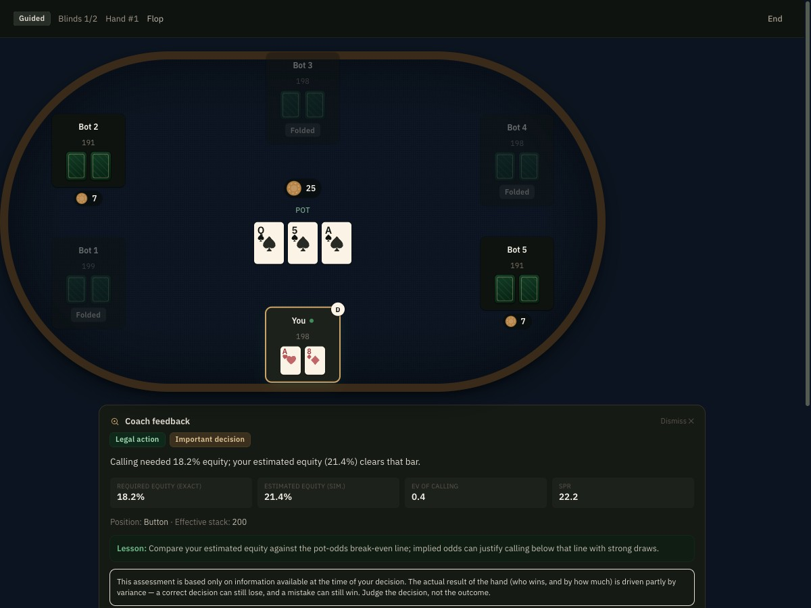

# Holdem Lab

A local, fictional-chips-only No-Limit Texas Hold'em trainer that pairs a genuinely correct poker engine with a
curriculum built around the probability and expected-value reasoning that decision-making under uncertainty actually
requires.



## Why this exists

Most "poker training" software is either a real-money client with no teaching layer, or a static quiz that never
lets you actually play a hand. I wanted something that could do both: deal genuinely random, rules-correct hands
against computer opponents, and pause to explain *why* a decision was good or bad using the same numbers a hand
review would show — pot odds, equity, expected value — rather than a vague "nice bet!" A secondary goal was
practicing the kind of fast, structured probabilistic reasoning that shows up in quantitative interviews, without
pretending poker fluency and interview readiness are the same skill.

## What it does

- **A complete, tested No-Limit Hold'em engine** — blinds, betting rounds, minimum raises, short all-ins, side pots,
  and showdown, all covered by unit tests (hand rankings, split pots, heads-up and multiway action order, seeded
  deals, a randomized multi-hand chip-conservation stress test).
- **Guided Play**, which pauses on your turn and, after you act, shows the pot odds, a Monte-Carlo equity estimate,
  and the resulting EV for that decision — judged on the information available at the time, independent of how the
  hand turns out.
- **Free Play** against five configurable bot personalities (tight-passive through balanced-advanced), for
  uninterrupted sessions.
- **A five-level curriculum**, from the rules and hand rankings through pot odds/EV/combinatorics/Bayes' theorem to
  range-based and GTO-adjacent concepts, each lesson with a short interactive check.
- **Decision Drills** with adaptive practice that weights questions toward whichever categories you're actually
  weak in, rather than sampling uniformly at random.
- **Rapid Decision Mode** — timed poker scenarios (20s/30s/60s/untimed) for practicing fast probability and EV
  calculations, decisions under uncertainty, and explaining your reasoning under a clock. It is not affiliated with,
  sponsored by, or a reproduction of any real company's interview questions — it trains the same category of
  transferable skill.
- **Hand Review** with street-by-street playback and JSON/text export, and a **Progress Dashboard** that tracks
  accuracy by topic rather than only fictional chip results (which are explicitly flagged as high-variance and not,
  on their own, a reliable measure of decision quality).
- A **Reference** section of calculators (pot odds, outs, equity, EV, combinations, bet sizing) that each show their
  formula, not just an output.

## How the engine is structured

The poker logic lives entirely under `src/engine`, `src/math`, and `src/bots`, with no UI imports — every file there
is unit-testable in isolation and none of it depends on React.

- `engine/cards.ts`, `engine/deck.ts` — card representation and a Fisher–Yates shuffle over a seedable PRNG (tests
  pass an explicit seed for reproducible deals; real play seeds from crypto randomness).
- `engine/handEvaluator.ts` — evaluates the best 5-card hand out of 5, 6, or 7 cards by exhaustively scoring every
  5-card combination. Written from scratch rather than pulled from an npm package — see
  [`docs/research.md`](docs/research.md#7-enginelibrary-decision) for why.
- `engine/potManager.ts` — computes main and side pots from each player's total contribution, including the
  "uncalled bet" refund rule (an all-in raise nobody could fully call gets its excess returned before pots are
  settled) and odd-chip handling on split pots.
- `engine/engine.ts` (`HandEngine`) — the betting state machine: blind posting, legal-action generation, street
  advancement, and showdown resolution. It throws a descriptive error rather than silently continuing whenever it's
  asked to do something the rules don't allow (e.g. acting out of turn, starting a hand mid-hand).
- `bots/botDecision.ts` — five heuristic personalities that combine a preflop hand-strength estimate with postflop
  Monte Carlo equity. They are explicitly not solvers; `src/bots/botInformationBoundary.test.ts` verifies a bot's
  decision function only ever receives its own hole cards and the public table state, never another player's cards
  or undealt future cards.

## Decision quality vs. outcome quality

The thing I most wanted to avoid was an app that grades you by what happened rather than by what you knew when you
acted. `src/training/coach.ts` builds every piece of Guided Play feedback from the table state *as it existed at the
moment of the decision* — no peeking at opponents' hole cards or future community cards — and every feedback panel
ends with an explicit reminder that a correct decision can still lose, and a mistake can still win. The same
separation is used in the drills: each explanation shows the calculation, the fastest mental shortcut, why tempting
wrong answers are wrong, and the assumptions that make the "correct" answer not universally unique.

Every number in the app is also labelled by what kind of claim it's making: **exact arithmetic** (pot odds, required
equity, combinatorics), a **simulation-based estimate** (Monte Carlo equity against a random hand or range), or a
**heuristic/strategic opinion** (bet-sizing advice, a bluff/value read). It does not present the third kind with the
same confidence as the first.

## Probability and EV training

Level 3 of the curriculum and the Decision Drills / Rapid Decision categories cover: counting outs, the "rule of 2
and 4" alongside its exact hypergeometric counterpart, pot odds and break-even equity, expected value of folding vs.
calling vs. betting, equity against a hand vs. a range, combinations and blockers, implied/reverse-implied odds, fold
equity, multi-branch EV trees, and conditional probability / Bayes' theorem (framed around updating a read on an
opponent's range from their bet, since that's the actual on-felt use of Bayesian updating rather than a generic
textbook example). Level 5 covers range construction, minimum defence frequency, and the difference between a
theoretically balanced (GTO-flavoured) line and an exploitative deviation — the app is explicit that real strategy is
often mixed and assumption-dependent, and doesn't present a single heuristic recommendation as the uniquely correct
answer where the underlying math doesn't support that claim.

## Technology

- **React + TypeScript + Vite** — a fast local dev loop and a static build with no server component to run or
  maintain.
- **Tailwind CSS v4** (CSS-first `@theme` config) for the design tokens — colour, type, radius, shadow, and motion
  scales are defined once in `src/index.css` and consumed as ordinary utility classes; see
  [`docs/design-system.md`](docs/design-system.md).
- **Zustand** for the two pieces of client state that actually need a store (the live table/session, and learning
  progress) — deliberately not Redux, since neither store needs middleware or time-travel debugging.
- **Vitest** for unit tests (engine, math, bots — no DOM or component-rendering dependency, since none of the
  current tests need one) and **Playwright** for end-to-end flows (completing a hand, winning by fold, reaching
  showdown, an all-in resolving cleanly, guided feedback appearing, and progress surviving a reload).
- **Fontsource** (self-hosted Fraunces / IBM Plex Sans / IBM Plex Mono) instead of a CDN font request, in keeping
  with the app being fully local-first.

## Running it locally

Requires Node 20+ and npm 10+.

```bash
npm install
npm run dev
```

Open the URL Vite prints (typically `http://localhost:5173`). No environment variables, API keys, or external
services are required — progress, settings, and hand histories are saved to your browser's `localStorage`.

```bash
npm run build     # production build (tsc -b && vite build) into dist/
npm run preview   # preview the production build locally
npm run lint      # oxlint
```

### Tests

```bash
npm run test        # unit tests (Vitest), single run
npm run test:watch  # unit tests, watch mode
npm run e2e         # Playwright end-to-end tests (needs `npx playwright install chromium` once, and the dev
                     # server running in another terminal — see e2e/poker.spec.ts)
```

## Project structure

```
src/
  engine/        Cards, deck, hand evaluator, pot/side-pot math, the betting state machine (HandEngine)
  bots/          Bot decision logic + the enforced "legal information only" observation boundary
  math/          Pot odds, outs (exact + rule-of-4/2), EV, combinatorics, Monte Carlo equity
  training/      Curriculum content, coaching-feedback builder, decision-drill generators, adaptive practice
  handHistory/   Hand recording, filtering, plain-text/JSON export
  state/         Zustand stores: live table/session state, learning progress
  storage/       localStorage read/write helpers
  components/    UI: poker table, action bar, coach panel, calculators, drill runner, playing cards, nav icons
  pages/         One file per route
docs/            Rules/strategy research notes and the visual design system
e2e/             Playwright end-to-end tests
```

## Current limitations

- Bots are heuristic, not solvers — they play coherent, personality-driven poker but won't hold a theoretically
  balanced strategy the way a trained GTO solver output would. This is stated explicitly in-app rather than implied.
- The starting-hand matrix and preflop range guidance are illustrative reference shapes, not a single "correct"
  solved chart; exact ranges depend on stack depth, opponents, and table dynamics.
- Playwright's own Chromium couldn't be launched inside the sandboxed environment this project was built in, so the
  e2e suite is written and was exercised manually rather than via CI at the time of writing — it should run normally
  in a standard local terminal or CI runner.
- No tournament-specific concepts (ICM, escalating blinds, push/fold charts) — the curriculum is scoped to
  transferable cash-game reasoning; see the roadmap below.

## Roadmap

- Tournament module (ICM, push/fold ranges, escalating blind structures) as an optional, clearly-labelled addition.
- Deeper procedurally-generated drills for board-texture classification and range-reading (currently a curated
  question bank rather than a fully parametric generator).
- A short, in-app suggested study sequence for players with a fixed amount of time to prepare, tying the existing
  Learn/Drills/Rapid-Decision modes together rather than leaving sequencing entirely up to the user.
- Wire up the existing Playwright suite in CI once a non-sandboxed runner is available to confirm it end-to-end.

## Research sources and third-party material

Rules and strategy content was cross-checked against multiple public sources rather than any single one; see
[`docs/research.md`](docs/research.md) for the full list with direct links (poker.org, PokerNews, PokerListings,
Upswing Poker, and GTO Wizard's educational blog, among others) and for the reasoning behind implementing the hand
evaluator and betting engine from scratch rather than depending on an unmaintained npm package. No solver output or
copyrighted text is reproduced anywhere in the app or its content.

## License

No license has been chosen for this repository yet. Until one is added, all rights are reserved by the author.

## Development note

Developed as an AI-assisted learning project. The product specification, curriculum direction, testing criteria, and
review were led by Rohan Chakravarty; AI assistance (Claude) was used throughout implementation, including the
engine, UI, and training content.
